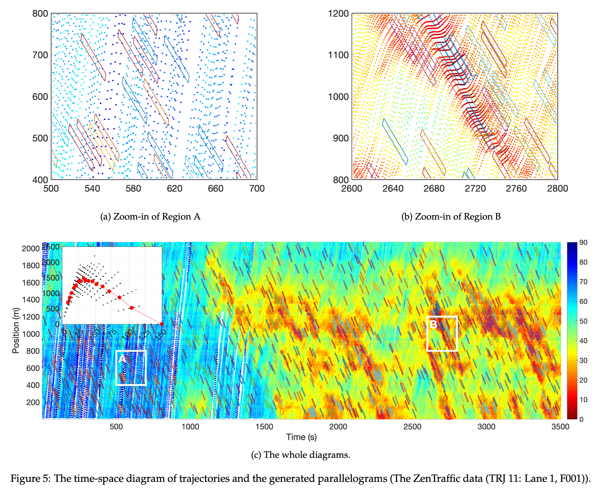
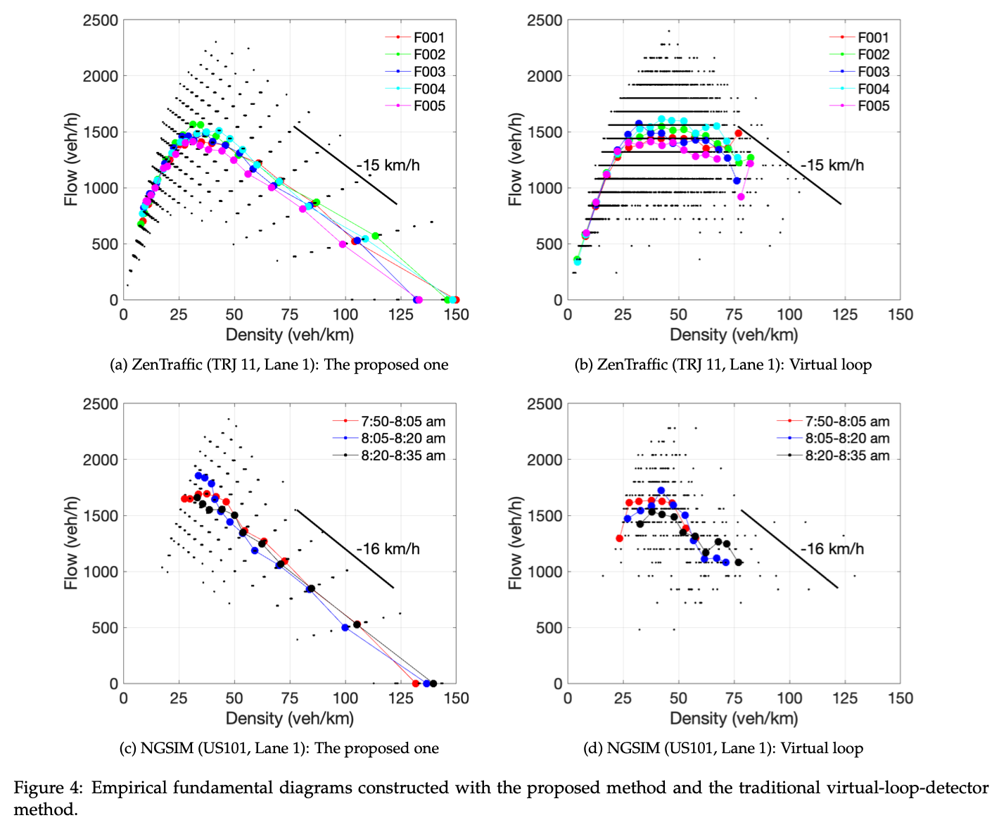

# Constructing the fundamental diagrams of traffic flow from large-scale vehicle trajectory data
**Abstract**: For decades, researchers and practitioners typically measure macroscopic traffic flow variables, i.e., density, flow, and speed, using time or space cuts, and then construct the fundamental diagrams of traffic flow. With the advent of large-scale vehicle trajectory datasets, often capturing 100% of vehicle dynamics, Edie’s generalized definitions have become widely recognized as the most appropriate framework for measuring these variables. However, while Edie’s formulation explicitly requires the traffic state within the measurement region to be both stationary and homogeneous, there is little guidance on how to systematically identify such qualified regions and construct the corresponding fundamental diagrams. To address this gap, this paper proposes an Edie’s definition-based method for measuring traffic variables and constructing the fundamental diagrams of traffic flow by automatically identifying stationary traffic states using parallelogram-shaped aggregation regions. An open-source tool is developed and released in https://github.com/gotrafficgo/construct_fundamental_diagram to support both researchers and practitioners. From now on, we have an automated tool that can generate fundamental diagrams directly from any large-scale time-space diagram of vehicle trajectories, either collected from the real world or generated by simulation.

# Watch video https://m.youtube.com/watch?v=lJVYIVtsLso

# Comparison with the fundamental diagrams generated using traditional ways



# 📄 Citation

If you find this work useful, please consider citing our paper:

> **Constructing the fundamental diagrams of traffic flow from large-scale vehicle trajectory data**  
> Zhengbing He, Cathy Wu  
> [arXiv:2507.09648](https://arxiv.org/abs/2507.09648)

```bibtex
@article{he2025constructing,
  title={Constructing the fundamental diagrams of traffic flow from large-scale vehicle trajectory data},
  author={He, Zhengbing and Wu, Cathy},
  journal={arXiv preprint arXiv:2507.09648},
  year={2024}
}
